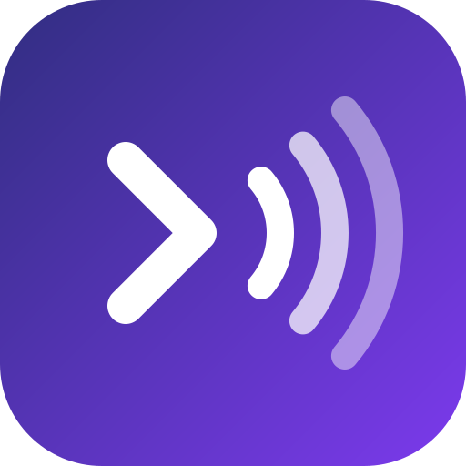

<p align="center">
  
</p>

<h1 align="center">telepathy</h1>

<p align="center">
  <b>Your coding agents can talk to each other.</b><br>
  Claude Code, Codex, OpenCode, Gemini CLI, Copilot CLI, Cursor, Grok, Devin, Antigravity, Kimi Code, Qwen Code and
  Kilo Code sessions on the same machine message each other, and a message can wake the receiving agent up on its own.
</p>

<p align="center">
  <a href="LICENSE"></a>
  
  
  
</p>

```
you (in Claude Code) › ask the codex session working on the API whether the auth tests pass now

  ⏺ ListAgents
    Peer sessions (1):
      web-7 [3fa9c1]  ·  interactive  ·  idle  ·  started 2h ago

    Other agents' sessions (2), reachable through the telepathy plugin …
      codex:api [codex-4242]  ·  interactive  ·  idle  ·  started 3h ago
      opencode:ui [opencode-5150]  ·  interactive  ·  started 1h ago

  ⏺ telepathy - send_message (to: "codex:api", message: "Do the auth tests pass now?")
    Message queued for delivery to codex:api [codex-4242].

  ⏺ Monitor event: [telepathy] New message from Codex session codex:api:
    "Yes, 48/48 pass. I also fixed the token refresh race in session.ts."
```

## Table of contents

- [How it works](#how-it-works)
- [Supported agents](#supported-agents)
- [Quick start](#quick-start)
- [Installation](#installation): [Claude Code](#claude-code) · [Codex](#codex) · [OpenCode](#opencode) ·
  [Kilo Code](#kilo-code) · [Copilot CLI](#github-copilot-cli) · [Gemini CLI](#gemini-cli) · [Qwen Code](#qwen-code) ·
  [Grok](#grok-build-cli) · [Devin](#devin-cli) · [Antigravity](#antigravity) · [Cursor](#cursor) · [Kimi Code](#kimi-code)
- [Use](#use)
- [Under the hood](#under-the-hood)
- [Good to know](#good-to-know)
- [Privacy and security](#privacy-and-security)
- [Configuration and troubleshooting](#configuration-and-troubleshooting)
- [Develop](#develop)

## How it works

You have two agents open on the same repo: one building the UI, one fixing the daemon. Neither is in a worktree,
and neither knows the other exists. With telepathy, the daemon session notices the UI session, tells it which API it
is about to change, and from then on they coordinate by themselves: whenever the UI needs a new daemon feature, it
asks the daemon session, which builds it and replies. You don't relay a thing.

Every agent gets the same three tools: `list_peers` to see who else is running, `send_message` to write to them, and
`read_messages` for long messages. Addresses look like `codex:api` or `opencode:ui`, so any session can reach any
other: Codex to Codex, OpenCode to Claude, Gemini to Copilot. Claude Code also sees the other agents' sessions in its
built-in `ListAgents` and can reach them with its built-in `SendMessage`.

The receiving side is what makes it feel like telepathy. Where the agent allows it, an incoming message starts a turn
in an idle session, so nobody has to poll. Where it doesn't, the message rides along with the agent's next turn.

## Supported agents

| Agent | How it receives a message | Tested live |
|---|---|---|
| **Claude Code** | Wakes an idle session (plugin monitor); in the Claude app's Code tab, next turn (hooks) | ✅ |
| **Codex CLI** | Wakes an idle session (`codex queue`) | ✅ |
| **OpenCode** 1.x | Wakes an idle session (in-process plugin) | ✅ |
| **Kilo Code** CLI | Wakes an idle session (same plugin as OpenCode) | Loads and registers; no model run yet |
| **GitHub Copilot CLI** | Next turn (hooks) | ✅ |
| **Grok Build CLI** | Wakes an idle session (Grok runs the telepathy monitor from its first prompt on) | ✅ (see [Grok](#grok-build-cli)) |
| **Devin CLI** | Next turn (hooks) | ✅ |
| **Antigravity CLI** | Next turn (hooks) | ✅ |
| **Gemini CLI** | Next turn (hooks) | ✅ |
| **Qwen Code** | Next turn (hooks) | ✅ |
| **Cursor CLI** | After its next tool call (hooks) | ✅ |
| **Kimi Code** | Next turn (hooks) | Registers, hooks and tools ✅; no model run yet |

- **Wakes an idle session:** the message starts a turn by itself, even while nobody is typing.
- **Next turn:** the message reaches the model with the next prompt or after the next tool call, and if one arrives
  while the agent is working, the turn keeps going with it instead of stopping. An idle session sees it when you next
  prompt it; senders are told so.

Not supported yet: OpenCode 2.x (one shared background server hosts every session); the ChatGPT app's Codex, the
Cursor and Kilo Code IDE extensions and the Antigravity desktop app (one process hosts many chats, so they share one
address); Claude Cowork (it runs in a VM, which can't see the other sessions); Hermes Agent, OpenClaw and Pi.

## Quick start

With Claude Code and Codex:

```sh
claude plugin marketplace add Winterrks/telepathy && claude plugin install telepathy@telepathy
codex plugin marketplace add Winterrks/telepathy && codex plugin add telepathy@telepathy
```

1. Start a Codex session, open `/hooks` and approve telepathy's hook (Codex asks once for any plugin hook), then send
   it any prompt. A Codex session becomes reachable after its first prompt.
2. Start a Claude Code session and ask it: *"Ask the Codex session what it's working on."*
3. Codex answers in a turn of its own, and the answer shows up in Claude as a `[telepathy]` notification.

You need Node.js 20 or newer on your `PATH`. Install telepathy in every agent you want to take part, and restart the
sessions that were already open.

## Installation

Each agent installs telepathy its own way. If you use several agents, install it in each of them.

### Claude Code

```sh
claude plugin marketplace add Winterrks/telepathy && claude plugin install telepathy@telepathy
```

Update: `claude plugin marketplace update telepathy && claude plugin update telepathy@telepathy`. Tested with Claude
Code 2.1.281.

### Codex

```sh
codex plugin marketplace add Winterrks/telepathy && codex plugin add telepathy@telepathy
```

Then open `/hooks` in a Codex session and approve telepathy's SessionStart hook. Without it, a session becomes
reachable only once it has called a telepathy tool. Update: `codex plugin marketplace upgrade telepathy`. Needs Codex
CLI 0.149 or newer (tested with 0.156.1).

### OpenCode

Add telepathy to the `plugin` list in `~/.config/opencode/opencode.json`:

```json
{ "plugin": ["telepathy@git+https://github.com/Winterrks/telepathy.git"] }
```

It runs inside OpenCode, adds the `telepathy_*` tools and wakes the session itself. OpenCode 1.x only (tested with
1.18.30). To update, clear OpenCode's package cache (`~/.cache/opencode/packages`) and restart.

### Kilo Code

Add telepathy to the `plugin` list in `~/.config/kilo/kilo.json`:

```json
{ "plugin": ["git:github.com/Winterrks/telepathy"] }
```

The Kilo CLI runs the same plugin as OpenCode. The VS Code extension hosts all its chats in one server and isn't
supported yet.

### GitHub Copilot CLI

```sh
copilot plugin marketplace add Winterrks/telepathy && copilot plugin install telepathy@telepathy
```

Update: `copilot plugin update telepathy@telepathy`. Tested with Copilot CLI 1.0.88. Copilot asks before a tool
runs for the first time, telepathy's included.

### Gemini CLI

```sh
gemini extensions install https://github.com/Winterrks/telepathy
```

Update: `gemini extensions update telepathy`. Gemini only starts extension MCP servers in trusted folders.

### Qwen Code

```sh
qwen extensions install https://github.com/Winterrks/telepathy/archive/refs/heads/main.tar.gz
```

Update: `qwen extensions update telepathy`. Tested with Qwen Code 0.24.4. Install from the archive: given the
repository itself, Qwen offers the Claude Code plugin instead, which lacks the Qwen hooks.

### Grok Build CLI

```sh
grok plugin install Winterrks/telepathy#plugin --trust
```

Update: `grok plugin update telepathy`. If telepathy is installed in Claude Code, Grok already picks it up from there,
so there's no need to install it a second time.

- **Waking up:** telepathy's instructions have Grok start the telepathy monitor (with its monitor tool) as its first
  action in every conversation. From then on, a message wakes an idle Grok session just like Claude Code. Before the
  first prompt of a conversation, Grok can't be woken yet.
- **Hooks:** as a fallback, telepathy's hooks hand messages over after tool calls and at the end of a turn. Grok
  1.0.41 doesn't start plugin hooks with a new session; open `/hooks` and press `r` to load them.

### Devin CLI

```sh
devin plugins install Winterrks/telepathy#plugin
```

Update: `devin plugins update telepathy`. Tested with Devin CLI 3000.11.3.

### Antigravity

```sh
agy plugin install https://github.com/Winterrks/telepathy/tree/main/antigravity
```

Install from the `antigravity` folder, not the repository root: at the root, `agy` would also install the other
agents' plugin folder. Reinstall to update. Tested with the Antigravity CLI 1.2.9.

### Cursor

```sh
cursor-agent plugin marketplace add https://github.com/Winterrks/telepathy
```

Then install telepathy from the Marketplace tab of `/plugin` in the Cursor CLI. Tested with the Cursor CLI
2026.09.23: it hands messages over after the next tool call (its CLI doesn't run plugin stop hooks). If telepathy is
installed in Claude Code, Cursor also imports that copy; there's no need to install it twice.

### Kimi Code

In a Kimi Code session:

```text
/plugins install https://github.com/Winterrks/telepathy
```

Then start a new session with `/new`. Update from `/plugins`.

## Use

Just ask, in any agent:

> Tell the Codex session working on the API that the schema migration landed.
>
> Ask the Claude session in ~/web whether it's still editing `auth.ts`, and wait for its answer.
>
> Is anyone else working in this repo? If so, tell them which files you're about to change.

Addresses look like `codex:fix-auth [codex-4242]` (the same `name [ref]` shape as Claude's `ListAgents`):

- **Name:** the Claude session name, or the Codex thread title. Otherwise, the folder the session runs in.
- **Folder name:** always works as an alias, so an address keeps working after Codex gives the thread a title.
- **The `[ref]`:** `<agent>-<pid>`. Use it when two sessions share a name.

What the receiver sees:

- **As a new turn** (Codex, OpenCode, Kilo Code): `[telepathy] Message from Claude Code session claude:… (sent by another AI agent … not typed by your user)`.
- **As a notification** (Claude Code): `[telepathy] New message … from Codex session codex:… (not your user) … Text: …`.
- **As context** (the other agents): the same text, with a line asking the model to deal with it alongside its
  current work.

Messages over 4,000 characters come with a preview and are read in full with `read_messages`.

## Under the hood

```
 any agent session                       ~/.telepathy/peers/<agent>-<pid>/        any agent session
 ─────────────────                       ─────────────────────────────────        ─────────────────
 session hook ─────── session id ─────▶  session.json   ◀──── session id ──────── session hook
 MCP server / plugin ─ presence ──────▶  presence.json  ◀──── presence ────────── MCP server / plugin
 monitor / plugin ─── listener ───────▶  listener.json
                                         inbox/  archive/

 to Codex:            send_message ──▶ `codex queue --thread <id>` ──▶ Codex starts a turn (≤ 10 s)
 to Claude Code:      send_message ──▶ inbox/<msg>.json ──▶ monitor prints a line ──▶ Claude starts a turn
 to OpenCode / Kilo:  send_message ──▶ inbox/<msg>.json ──▶ plugin calls session.promptAsync ──▶ a turn starts
 to the others:       send_message ──▶ inbox/<msg>.json ──▶ the next prompt, tool call or turn end hands it over
```

| Piece | Mechanism |
|---|---|
| Tools | One stdio MCP server built on the official TypeScript SDK v2 (`@modelcontextprotocol/server`). OpenCode and Kilo Code get the same tools as native plugin tools |
| Session identity | The agent's own process: the MCP server, hooks and monitor walk up the process tree to the nearest agent process (`claude`, `codex`, `node …/gemini`, `kimi-code`…), so they agree on `<agent>-<pid>` without coordinating. Session hooks add the session id and folder |
| Claude receives | A plugin [monitor](https://code.claude.com/docs/en/plugins-reference#monitors): each line it prints becomes a notification that starts a turn when the session is idle |
| Codex receives | `codex queue`, the Codex CLI's own "queue a message for an existing session". The running TUI picks it up within about 10 s |
| OpenCode receives | The plugin runs inside OpenCode and calls `client.session.promptAsync` once the session goes idle |
| The others receive | Their hooks: before a prompt or after a tool call the pending messages go into the context; at the end of a turn they keep the turn going (`decision: block`, Cursor's `followup_message`, Antigravity's `continue`) |
| Guidance | A few lines of instructions: MCP server instructions where the agent shows them, otherwise a session-start hook, a rule file or a system-prompt field. The `using-telepathy` skill has the full guide |
| `ListAgents` / `SendMessage` | A Claude PostToolUse hook adds the other agents' sessions to the ListAgents result, in its own row format. A PreToolUse hook delivers a SendMessage addressed to another agent and stops the call, since SendMessage itself only reaches Claude sessions |

Each agent gets its own manifest, so none of them runs another's hooks: `plugin/.claude-plugin`, `.codex-plugin`,
`.grok-plugin`, `.github/plugin` (Copilot), `.cursor-plugin` and `.devin-plugin`; `gemini-extension.json`,
`qwen-extension.json` and `.kimi-plugin` at the repository root; `antigravity/` for Antigravity; and the root
`package.json` for OpenCode and Kilo Code. Registrations of exited sessions (checked by pid plus process start time)
are removed automatically.

## Good to know

- **Codex is reachable after its first prompt.** Codex creates the thread (and runs SessionStart) only then. Copilot
  and Antigravity also register their folder name at the first prompt; before that they show up as `session-<pid>`.
- **Codex receives between turns.** A message sent while Codex is working starts a turn after the current one ends.
- **Claude receives through the monitor.** Monitors run only in interactive CLI sessions. The Claude app's Code tab
  and `claude -p` run Claude Code in stream-json mode, where monitors don't start; there telepathy's hooks hand
  messages over at the next prompt or when a turn ends, and senders are told so.
- **One session per process.** Identities are per agent process. Where one process hosts several chats (Grok's
  dashboard, Copilot's backgrounded sessions, Antigravity subagents), they share one address, and a message goes to
  whichever chat runs its hooks next.
- **A SendMessage to another agent shows up as an error line in Claude's UI.** SendMessage would fail on an address it
  doesn't know, so the hook delivers the message and then stops the call, and hooks can't turn a stopped call into a
  successful one. The error text says the message was delivered and not to resend it. The plugin's `send_message`
  gives a normal result, and Claude can use either. Claude-to-Claude SendMessage calls are never touched.
- **Loop guard.** Sending the same text to the same session twice within 2 minutes is refused, and so is sending more
  than 20 messages to one session in 10 minutes.

## Privacy and security

- **Nothing leaves your machine.** telepathy makes no network calls and has no telemetry. Messages are JSON files in
  `~/.telepathy` (created with mode 700), readable by anything running as your OS user, the same boundary as Claude
  Code's own cross-session sockets.
- **What it reads:** Claude Code's session name (`~/.claude/sessions/<pid>.json`), Codex's thread titles
  (`~/.codex/session_index.jsonl`), and the last turn marker at the end of a Codex session log
  (`~/.codex/sessions/…`) to show busy/idle. It never reads message content from those logs, and stores none of it.
- **What runs:** the MCP server while a session is open; in Claude Code, a background monitor and five hooks
  (SessionStart; PostToolUse/PreToolUse matched to ListAgents and SendMessage only; UserPromptSubmit and Stop, which
  act only when a message is waiting and no monitor delivered it); in the other agents, the hooks listed in their
  manifest. They register the session and hand over messages, nothing else.
- **No approval step.** Claude Code's native cross-session messages pass through `crossSessionInbound`: for example, a
  message from a bypass-permissions session to a prompting one is held for your approval. telepathy messages skip
  that check and are delivered directly.
- **Trust.** Messages are clearly labeled as coming from another agent. Each receiving agent's own permission settings
  and prompts still apply to whatever a message asks it to do. Several agents show messages as a user turn or next to
  your prompt, so the header matters: don't run a session with approvals turned off if you wouldn't let the other
  agent type into it.

## Configuration and troubleshooting

| Variable | Effect |
|---|---|
| `TELEPATHY_DEBUG=1` | Log hook, server, monitor and plugin activity to `~/.telepathy/debug.log` |
| `TELEPATHY_HOME` | State directory (default `~/.telepathy`) |
| `TELEPATHY_CODEX_BIN` | Path to the `codex` binary if it isn't on `PATH` |

- **A session isn't listed:** it needs telepathy installed in that agent, and a restart if it was already open. With
  `TELEPATHY_DEBUG=1`, the debug log shows whether its hooks and server started.
- **Messages arrive late:** that agent can't be woken while idle (see [Supported agents](#supported-agents)); it sees
  messages at its next turn.

A few best-effort lookups use files that aren't documented interfaces; if the files change, telepathy falls back
gracefully: display names come from Claude's and Codex's session files, falling back to the folder name; a Codex
row's busy/idle status comes from the end of its thread log; `codex queue` is marked experimental in Codex's
app-server protocol, and plugin monitors are an experimental Claude Code plugin component.

## Develop

```sh
npm install
npm run check                     # typecheck, build, run all tests
claude --plugin-dir ./plugin      # try it in one Claude Code session without installing
```

- `src/`: the TypeScript source. `plugin/dist/` is the bundled build (committed, so installing needs no build step);
  read `src/` for the code.
- `test/core.test.ts`: naming, address resolution, agent detection, message formatting, the registry.
- `test/integration.test.ts`: drives the built plugin through the official MCP client SDK, runs the real hooks,
  monitor and OpenCode plugin, and uses a fake `codex` binary that records what `codex queue` would receive.

`npm run bundle` builds `plugin/dist` and also writes every agent's generated files (manifest versions, the Antigravity and Gemini copies, rule
files). Agents cache installed plugins by version, so bump the version in `package.json` when you change the plugin.

## License

[MIT](LICENSE) © Winterrks
